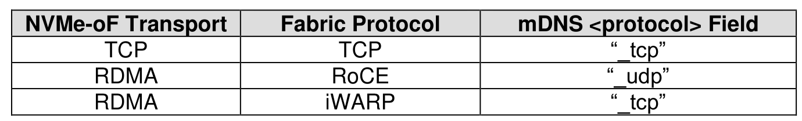
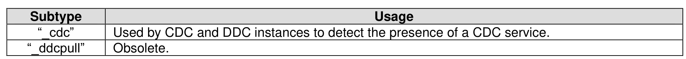
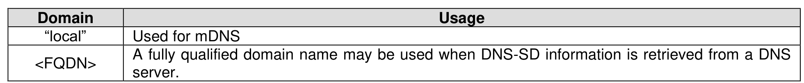

###### 8.3.1.1.1 Query

> **Section ID**: 8.3.1.1.1 | **Page**: 698-699

To facilitate the discovery of Discovery controller IP fabric interface addresses, hosts, CDCs and DDCs
may transmit an mDNS query (refer to RFC 6762) or a DNS query (refer to RFC 1034 and RFC 1035) that
includes a DNS PTR record (refer to RFC 6763) with the name in the form of:
“<Service>.<Domain>”.
The <Service> portion of the name can be further broken down into:
“<service name>.<protocol>”.
For NVMe over Fabrics, the DNS PTR record included in the mDNS or DNS query shall be in the form of:
“_nvme-disc.<protocol>.<domain>”; or
“_<subtype>._sub._nvme-disc.<protocol>.<domain>”.
The protocol field shall be set as shown in Figure 732.
The subtype field shall be set as shown in Figure 733.
The domain field shall be set as shown in Figure 734.

---
### 📊 Tables (3)

#### Table 1: Untitled Table

| | Usage |
|---|---|
| | ODC instances to detect the presence of a CDC service. |
| | |
| | |
| | |
| | |
| | |
| | |
| | |
| | |
| | |
| | |

#### Table 2: Untitled Table

(Continuation of Untitled Table - see first part)

#### Table 3: Untitled Table

(Continuation of Untitled Table - see first part)

