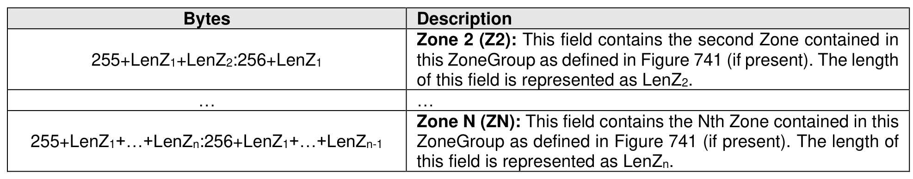

###### 8.3.2.3.2 ZoneGroup

> **Section ID**: 8.3.2.3.2 | **Page**: 710-711

A ZoneGroup is the unit of activation (i.e., a set of access control rules enforceable by the CDC). The
detailed representation of a ZoneGroup is shown in Figure 740.
A ZoneGroup is uniquely identified by the pair {ZoneGroup Name, ZoneGroup Originator}. For each
ZoneGroup, the CDC shall maintain:
•
a unique ZoneGroup key, used as a compact ZoneGroup identifier in the FZS and FZR commands
(refer to sections 5.4.7 and 5.4.6 respectively). ZoneGroup keys should not be reused; and
•
a generation number, incremented each time a ZoneGroup is updated and used by the GAZ
operation (refer to section 8.3.2.3.8.2). If the value of the generation number is FFFFFFFFh, then
the generation number shall be set to 1h when incremented (i.e., rolls over to 1h).

---
### 📊 Tables (2)

#### Table 1: Untitled Table

| 255:254 | Number of Zones (NUMZ): This field specifies the number of Zones contained in this ZoneGroup. The value of this field is represented as n. |
|---|---|
| 255+LenZ1:256 | Zone 1 (Z1): This field contains the first Zone contained in this ZoneGroup as defined in Figure 741. The length of this field is represented as LenZ1. |
| 686 | |
| 255+LenZ1+LenZ2:256+LenZ1 | this ZoneGroup as defined in Figure 741 (if present). The length of this field is represented as LenZ2. |
| ... | ... |
| LenZ1+...+LenZn:256+LenZ1+...+LenZn-1 | Zone N (ZN): This field contains the Nth Zone contained in this ZoneGroup as defined in Figure 741 (if present). The length of this field is represented as LenZn. |

#### Table 2: Untitled Table

(Continuation of Untitled Table - see first part)

