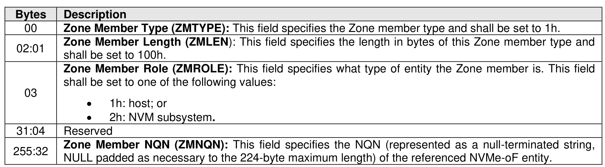

###### 8.3.2.3.4.2 {NQN, Role} Zone Member Type (Type 1h)

> **Section ID**: 8.3.2.3.4.2 | **Page**: 712-712

This Zone member type identifies all fabric interfaces, all IP protocols (e.g., TCP or UDP), and all IP protocol
ports (e.g., TCP port 4420) that may be used by the NVMe-oF entity identified by the Zone member’s NQN.
The format of this Zone member type is shown in Figure 743.

---
### 📊 Tables (1)

#### Table 1: Untitled Table

| 688 |

