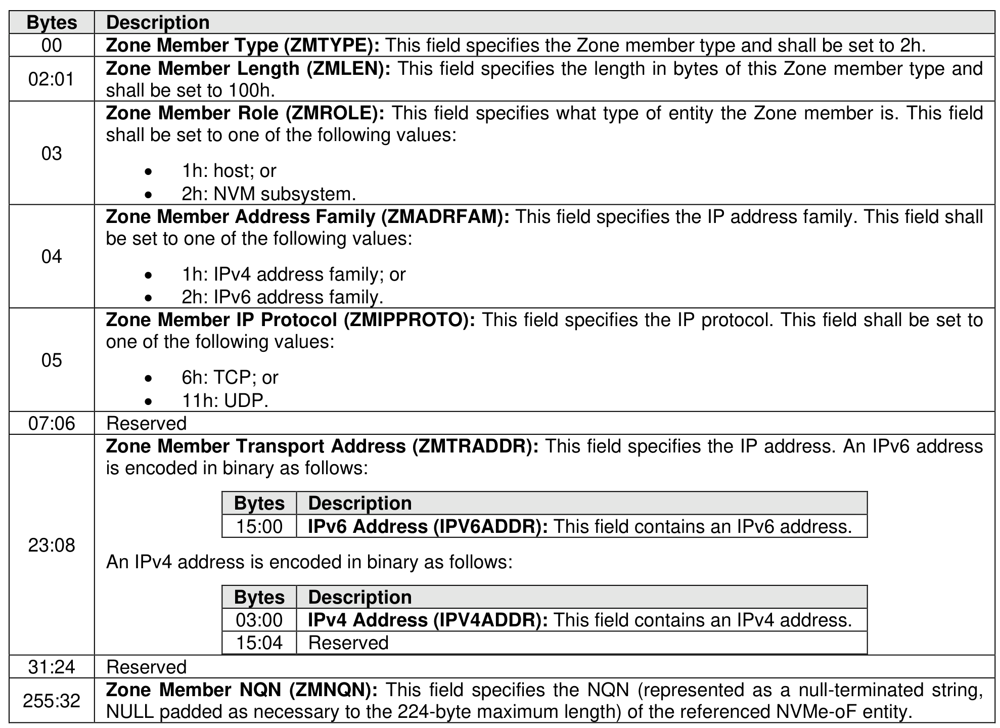

###### 8.3.2.3.4.3 {(NQN, IP, Protocol), Role} Zone Member Type (Type 2h)

> **Section ID**: 8.3.2.3.4.3 | **Page**: 713-713

This Zone member type identifies a specific fabric interface (i.e., through the IP address) and the specific
IP protocol (e.g., TCP) used by the NVMe-oF entity identified by the Zone member’s NQN over that fabric
interface. The format of this Zone member type is shown in Figure 744.

---
### 📊 Tables (1)

#### Table 1: Untitled Table

| Description | |
| :--- | :--- |
| Zone Member Type (ZMTYPE): This field specifies the Zone member type and shall be set to 3h. | |
| Zone Member Length (ZMLEN): This field specifies the length in bytes of this Zone member type and shall be set to 100h. | |
| Zone Member Role (ZMROLE): This field specifies what type of entity the Zone member is. This field shall be set to one of the following values: | |
| • 1h: host; or | |
| • 2h: NVM subsystem. | |
| Zone Member Address Family (ZMADRFAM): This field specifies the IP address family. This field shall be set to one of the following values: | |
| • 1h: IPv4 address family; or | |
| • 2h: IPv6 address family. | |
| Zone Member IP Protocol (ZMIPPROTO): This field specifies the IP protocol. This field shall be set to one of the following values: | |
| • 6h: TCP; or | |
| • 11h: UDP. | |
| Reserved | |
| Zone Member Transport Address (ZMTRADDR): This field specifies the IP address. An IPv6 address is encoded in binary as follows: | |
| Bytes | Description |
| 15:00 | IPv6 Address (IPV6ADDR): This field contains an IPv6 address. |
| An IPv4 address is encoded in binary as follows: | |
| Bytes | Description |
| 03:00 | IPv4 Address (IPV4ADDR): This field contains an IPv4 address. |
| 15:04 | Reserved |
| Reserved | |
| Zone Member NQN (ZMNQN): This field specifies the NQN (represented as a null-terminated string, NULL padded as necessary to the 224-byte maximum length) of the referenced NVMe-oF entity. | |
| 4 {(NQN, IP, Protocol, IP Protocol Port), Role} Zone Member Type (Type 3h) | |
| The member type identifies a specific fabric interface (i.e., through the IP address), the specific IP protocol (e.g., TCP), and IP protocol port (e.g., TCP port 4420) used by the NVMe-oF entity identified by the member's NQN over that fabric interface. The format of this Zone member type is shown in Figure | |
| Figure 745: {(NQN+IP+Protocol+IP Protocol Port), Role} Zone Member Format | |
| Description | |
| Zone Member Type (ZMTYPE): This field specifies the Zone member type and shall be set to 3h. | |
| Zone Member Length (ZMLEN): This field specifies the length in bytes of this Zone member type and | |

