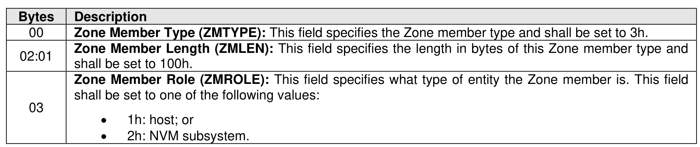
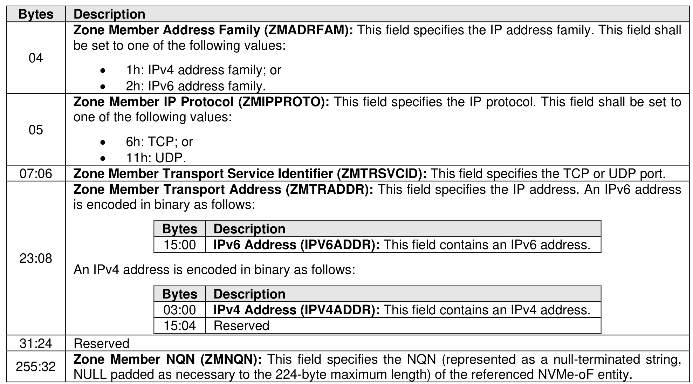

###### 8.3.2.3.4.4 {(NQN, IP, Protocol, IP Protocol Port), Role} Zone Member Type (Type 3h)

> **Section ID**: 8.3.2.3.4.4 | **Page**: 713-714

This Zone member type identifies a specific fabric interface (i.e., through the IP address), the specific IP
protocol (e.g., TCP), and IP protocol port (e.g., TCP port 4420) used by the NVMe-oF entity identified by
the Zone member’s NQN over that fabric interface. The format of this Zone member type is shown in Figure
745.

---
### 📊 Tables (2)

#### Table 1: Untitled Table

| | |
| :--- | :--- |
| | be set to one of the following values: |
| | • 1h: IPv4 address family; or |
| | • 2h: IPv6 address family. |
| **Zone Member IP Protocol (ZMIPPROTO):** This field specifies the IP protocol. This field shall be set to one of the following values: | |
| | • 6h: TCP; or |
| | • 11h: UDP. |
| **Zone Member Transport Service Identifier (ZMTRSVCID):** This field specifies the TCP or UDP port. | |
| **Zone Member Transport Address (ZMTRADDR):** This field specifies the IP address. An IPv6 address is encoded in binary as follows: | |
| | **Bytes** | **Description** |
| | 15:00 | **IPv6 Address (IPV6ADDR):** This field contains an IPv6 address. |
| | |
| | An IPv4 address is encoded in binary as follows: |
| | **Bytes** | **Description** |
| | 03:00 | **IPv4 Address (IPV4ADDR):** This field contains an IPv4 address. |
| | 15:04 | Reserved |
| | |
| | Reserved |
| **Zone Member NQN (ZMNQN):** This field specifies the NQN (represented as a null-terminated string, NULL padded as necessary to the 224-byte maximum length) of the referenced NVMe-oF entity. | |
| | |
| | |
| | |
| | |
| | |
| | |
| | |
| | |
| | |
| |

#### Table 2: Untitled Table

(Continuation of Untitled Table - see first part)

