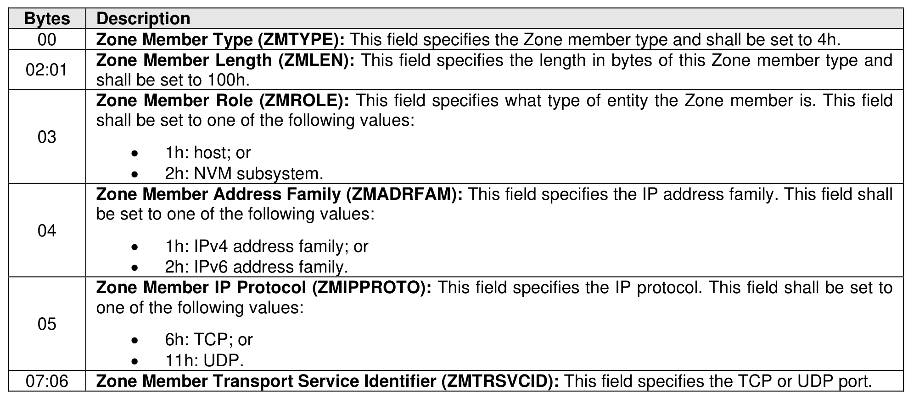
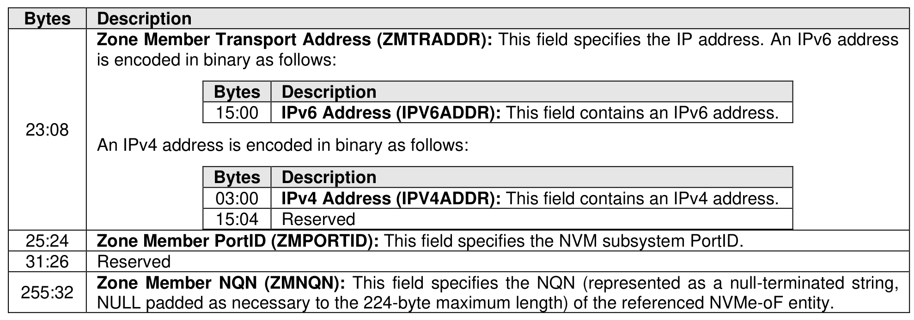

###### 8.3.2.3.4.5 {(NQN, IP, Protocol, IP Protocol Port, PortID), Role} Zone Member Type (Type 4h)

> **Section ID**: 8.3.2.3.4.5 | **Page**: 714-715

This Zone member type identifies a specific fabric interface (i.e., through the IP address), the specific IP
protocol (e.g., TCP), IP protocol port (e.g., TCP port 4420), and PortID used by the NVMe-oF entity
identified by the Zone member’s NQN over that fabric interface. The format of this Zone member type is
shown in Figure 746.

---
### 📊 Tables (2)

#### Table 1: Untitled Table

| Bytes | Description |
|---|---|
| 15:00 | IPv6 Address (IPV6ADDR): This field contains an IPv6 address. |
| 03:00 | IPv4 Address (IPV4ADDR): This field contains an IPv4 address. |
| 15:04 | Reserved |
| | Zone Member PortID (ZMPORTID): This field specifies the NVM subsystem PortID. |
| | Reserved |
| | Zone Member NQN (ZMNQN): This field specifies the NQN (represented as a null-terminated string, NULL padded as necessary to the 224-byte maximum length) of the referenced NVMe-oF entity. |

#### Table 2: Untitled Table

(Continuation of Untitled Table - see first part)

