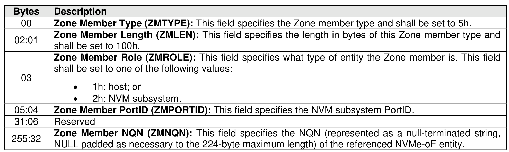

###### 8.3.2.3.4.6 {(NQN, PortID), Role} Zone Member Type (Type 5h)

> **Section ID**: 8.3.2.3.4.6 | **Page**: 715-715

This Zone member type identifies a specific PortID used by the NVMe-oF entity identified by the Zone
member’s NQN. The format of this Zone member type is shown in Figure 747.

---
### 📊 Tables (1)

#### Table 1: Untitled Table

| Description |
|:---|
| Zone Member Type (ZMTYPE): This field specifies the Zone member type and shall be set to 6h. |
| Zone Member Length (ZMLEN): This field specifies the length in bytes of this Zone member type and shall be set to 100b. |
| Zone Member PortID (ZMPORTID): This field specifies the NVM subsystem PortID. |
| Reserved |
| Zone Member NQN (ZMNQN): This field specifies the NQN (represented as a null-terminated string, NULL padded as necessary to the 224-byte maximum length) of the referenced NVMe-oF entity. |

