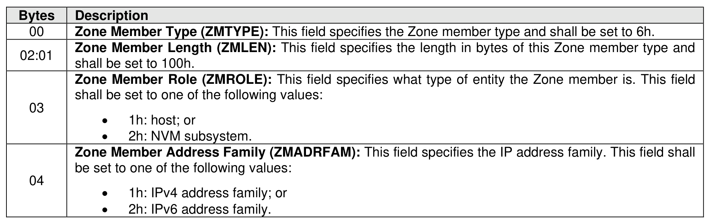
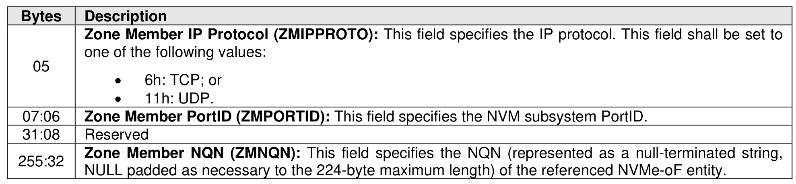

###### 8.3.2.3.4.7 {(NQN, Protocol, PortID, ADRFAM), Role} Zone Member Type (Type 6h)

> **Section ID**: 8.3.2.3.4.7 | **Page**: 715-716

This Zone member type identifies the specific IP protocol (e.g., TCP), PortID, and Address Family used by
the NVMe-oF entity identified by the Zone member’s NQN over that fabric interface. The format of this Zone
member type is shown in Figure 748.

---
### 📊 Tables (2)

#### Table 1: Untitled Table

| one of the following values: |  |
| :--- | :--- |
| • 6h: TCP; or |  |
| • 11h: UDP. |  |
| **Zone Member PortID (ZMPORTID):** This field specifies the NVM subsystem PortID. |  |
| Reserved |  |
| **Zone Member NQN (ZMNQN):** This field specifies the NQN (represented as a null-terminated string, NULL padded as necessary to the 224-byte maximum length) of the referenced NVMe-oF entity. |  |
| **4.8 {(IP, Protocol), Role} Zone Member Type (Type 11h)** |  |
| The member type identifies the fabric interface (i.e., through the IP address) of an NVMe-oF entity |  |
| specific IP protocol (e.g., TCP) used by the NVMe-oF entity over that fabric interface. The format |  |
| one member type is shown in Figure 749. |  |

#### Table 2: Untitled Table

(Continuation of Untitled Table - see first part)

