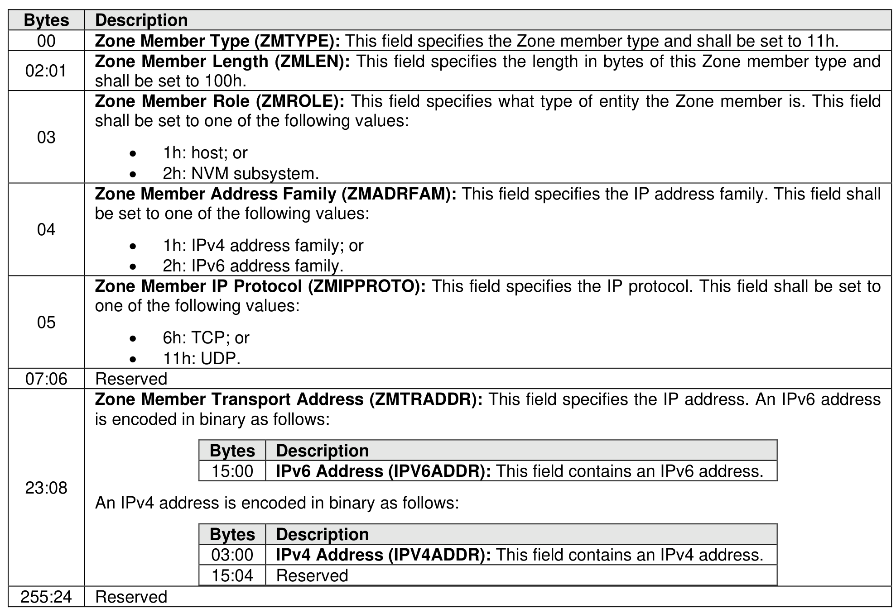

###### 8.3.2.3.4.8 {(IP, Protocol), Role} Zone Member Type (Type 11h)

> **Section ID**: 8.3.2.3.4.8 | **Page**: 716-716

This Zone member type identifies the fabric interface (i.e., through the IP address) of an NVMe-oF entity
and the specific IP protocol (e.g., TCP) used by the NVMe-oF entity over that fabric interface. The format
of this Zone member type is shown in Figure 749.

---
### 📊 Tables (1)

#### Table 1: Untitled Table

| Bytes | Description |
|:---|:---|
| 15:00 | IPv6 Address (IPV6ADDR): This field contains an IPv6 address. |
| 03:00 | IPv4 Address (IPV4ADDR): This field contains an IPv4 address. |
| 15:04 | Reserved |

