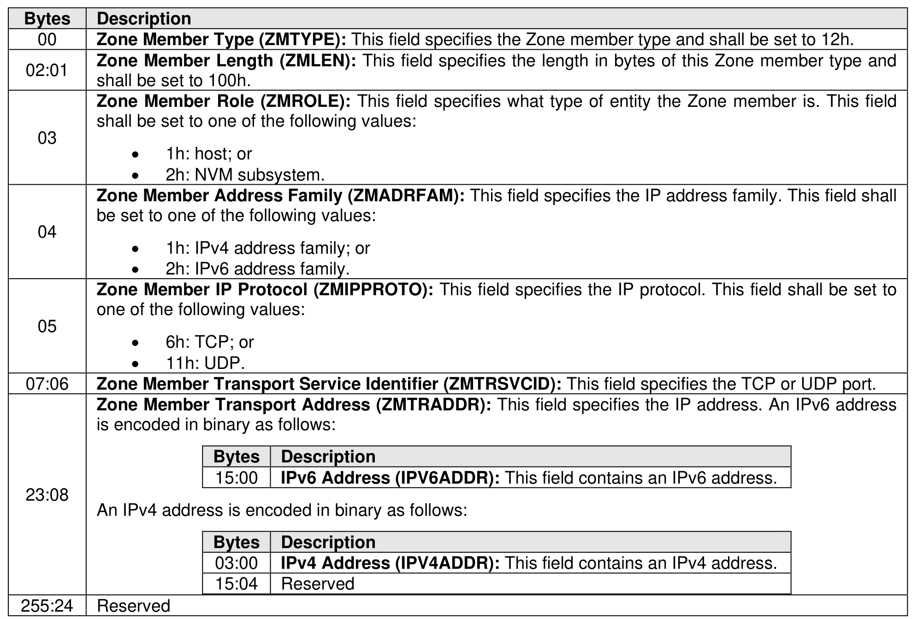

###### 8.3.2.3.4.9 {(IP, Protocol, IP Protocol Port), Role} Zone Member Type (Type 12h)

> **Section ID**: 8.3.2.3.4.9 | **Page**: 716-717

This Zone member type identifies the fabric interface (i.e., through the IP address) of an NVMe-oF entity,
the specific IP protocol (e.g., TCP), and IP protocol port (e.g., TCP port 4420) used by the NVMe-oF entity
over that fabric interface. The format of this Zone member type is shown in Figure 750.

---
### 📊 Tables (1)

#### Table 1: Untitled Table

| Description | |
| :--- | :--- |
| Zone Member Type (ZMTYPE): This field specifies the Zone member type and shall be set to EFh. | |
| Zone Member Length (ZMLEN): This field specifies the length in bytes of this Zone member type and shall be set to 100h. | |
| Zone Member Role (ZMROLE): This field specifies what type of entity the Zone member is. This field shall be set to one of the following values: | |
| • 1h: host; or | |
| • 2h: NVM subsystem. | |
| Zone Member Address Family (ZMADRFAM): This field specifies the IP address family. This field shall be set to one of the following values: | |
| • 1h: IPv4 address family; or | |
| • 2h: IPv6 address family. | |
| Zone Member IP Protocol (ZMIPPROTO): This field specifies the IP protocol. This field shall be set to one of the following values: | |
| • 6h: TCP; or | |
| • 11h: UDP. | |
| Zone Member Transport Service Identifier (ZMTRSVCID): This field specifies the TCP or UDP port. | |
| Zone Member Transport Address (ZMTRADDR): This field specifies the IP address. An IPv6 address is encoded in binary as follows: | |
| | |
| | |
| | |
| | |
| | |
| | |
| | |
| | |
| | |
| |

