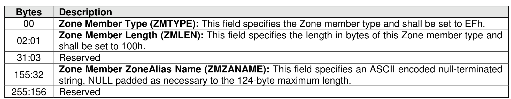

###### 8.3.2.3.4.10 {ZoneAlias} Zone Member Type

> **Section ID**: 8.3.2.3.4.10 | **Page**: 717-717

This Zone member type is used to identify a ZoneAlias in a Zone definition. The format of this Zone member
type is shown in Figure 751.

---
### 📊 Tables (1)

#### Table 1: Untitled Table

| Type | Definition |
|---|---|
| 1h | Fabric Enforced Zone |

