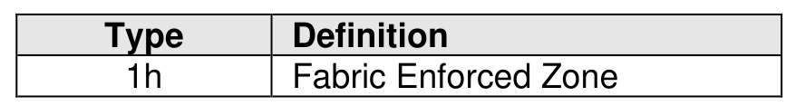
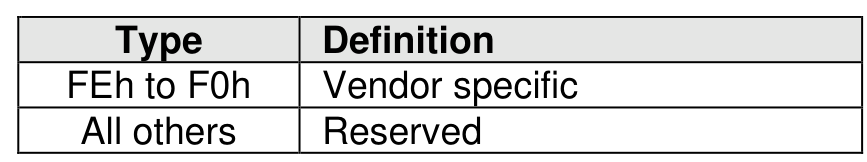

###### 8.3.2.3.5.1 Overview

> **Section ID**: 8.3.2.3.5.1 | **Page**: 717-718

Zone properties are represented as type-length-value (TLV) data structures. Unrecognized Zone properties
may be ignored. Figure 752 shows the defined Zone property types.

---
### 📊 Tables (2)

#### Table 1: Untitled Table

| | |
|---|---|
| | |

#### Table 2: Untitled Table

(Continuation of Untitled Table - see first part)

