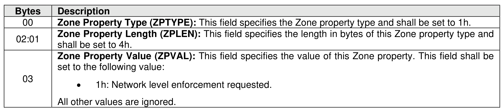

###### 8.3.2.3.5.2 Fabric Enforced Zone Property

> **Section ID**: 8.3.2.3.5.2 | **Page**: 718-718

This Zone property specifies if a Zone is intended to be enforced through packet-by-packet network level
restrictions. The format of this Zone property is shown in Figure 753.

---
### 📊 Tables (1)

#### Table 1: Untitled Table

| | Description |
|---|---|
| Zone Property Value (ZPVAL) | This field specifies the value of this Zone property. This field shall be set to the following value: • 1h: Network level enforcement requested. All other values are ignored. |

