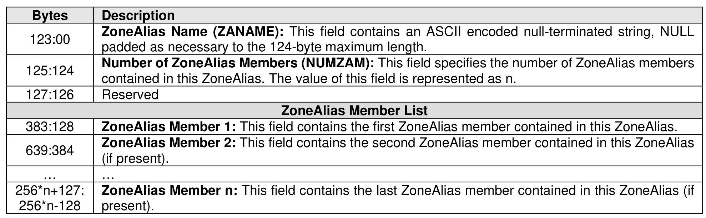

###### 8.3.2.3.6 ZoneAlias

> **Section ID**: 8.3.2.3.6 | **Page**: 718-718

A ZoneAlias is a convenient grouping of NVMe entities identified and is referenceable by a ZoneAlias name.
The detailed representation of a ZoneAlias is shown in Figure 754.

---
### 📊 Tables (1)

#### Table 1: Untitled Table

| | |
|---|---|
| | (if present). |
| | ... |
| 127: 128 | **ZoneAlias Member n**: This field contains the last ZoneAlias member contained in this ZoneAlias (if present). |

