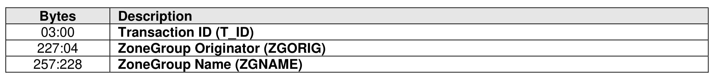
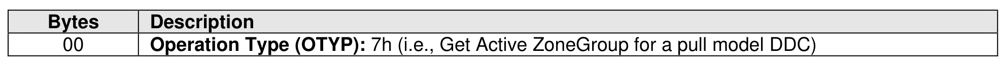
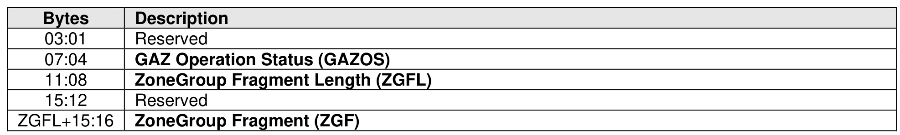

###### 8.3.2.3.8.3.1 Get Active ZoneGroup (GAZ)

> **Section ID**: 8.3.2.3.8.3.1 | **Page**: 723-724

The Get Active ZoneGroup (GAZ) operation allows a DDC to retrieve from the CDC an active ZoneGroup
associated with that DDC. For a pull model DDC the GAZ operation is mapped to a Pull Model DDC Request
asynchronous event notification (refer to Figure 154). The CDC responds to that asynchronous event
notification with a Get Log Page command requesting the Pull Model DDC Request log page (refer to
section 5.2.12.3.6), to which the DDC responds with a log page requesting a GAZ operation for a specified
ZoneGroup. The GAZ operation is then completed by the CDC by issuing one or more FZS commands to
send that ZoneGroup and the operation status to the DDC, as shown in Figure 763.
The format of the operation specific parameters of a Pull Model DDC Request log page requesting a GAZ
operation is shown in Figure 764.
The Transaction ID field is used to relate the Pull Model DDC Request log page for a pull model GAZ to the
subsequent FZS command(s). The Zoning Data Key in Command Dword 10 (refer to Figure 546) in the
FZS command(s) shall be set to the received Transaction ID value. The ZoneGroup definition is sent
through one or more subsequent FZS commands and is provided in the FZS buffer, as shown in Figure
765. The FZS command sending the last fragment shall have the Last Fragment (LF) bit set to ‘1’ in
Command Dword 12 (refer to Figure 548).
The GAZ Operation Status field is used to encode status information for the pull model GAZ operation, as
shown in Figure 773.
When a ZoneGroup is transferred in multiple fragments, if the CDC detects the ZoneGroup definition has
changed while sending the fragments, then the CDC shall issue an FZS command with a zero length
ZoneGroup fragment and GAZ operation status set to 5h (i.e., ZoneGroup Changed), and the GAZ
operation shall be aborted.
If the ZoneGroup indicated in the Pull Model DDC Request log page for a pull model GAZ operation does
not exist on the CDC, then the CDC shall issue an FZS command with a zero length ZoneGroup fragment
and GAZ operation status set to 2h (i.e., Zoning Data Structure Not Found), and the GAZ operation shall
be aborted.
If the ZoneGroup indicated in the Pull Model DDC Request log page for a pull model GAZ operation is
locked on the CDC (i.e., another administrative interface outside the scope of this specification is modifying
that ZoneGroup), then the CDC shall issue an FZS command with a zero length ZoneGroup fragment and
GAZ operation status set to 3h (i.e., Zoning Data Structure Locked), and the GAZ operation shall be
aborted.
If the ZoneGroup indicated in the Pull Model DDC Request log page for a pull model GAZ operation is not
locked on the CDC, then the CDC shall continue the GAZ operation by issuing one or more subsequent
FZS commands containing the fragments of the requested ZoneGroup. The last fragment shall specify GAZ
operation status cleared to 0h (i.e., Operation Successful), and the other fragments shall specify GAZ
operation status set to 1h (i.e., Operation in Progress).
The DDC shall not process received ZoneGroup information until the entire ZoneGroup (i.e., all of the
fragments of the ZoneGroup) is received.
The CDC may enforce access restrictions to the Zoning data structures. In this case, the CDC shall check
if the DDC requesting the GAZ operation is authorized to read the ZoneGroup indicated in Pull Model DDC
Request log page for Pull Model GAZ operation (e.g., if the CDC allows access to a ZoneGroup only to the
DDC that created that ZoneGroup, verify that the ZoneGroup Originator field matches the NQN contained
in the SUBNQN field of the Connect command sent from the CDC to that DDC). If that DDC is not authorized
to access the specified ZoneGroup, then the CDC shall issue an FZS command with a zero length
ZoneGroup fragment and GAZ operation status set to 4h (i.e., ZoneGroup Originator Invalid), and the GAZ
operation shall be aborted.

---
### 📊 Tables (3)

#### Table 1: Untitled Table

| | Description |
|---|---|
| | **Operation Type (OTYP):** 7h (i.e., Get Active ZoneGroup for a pull model DDC) |
| | |
| 4 | **GAZ Operation Status (GAZOS)** |
| 8 | **ZoneGroup Fragment Length (ZGFL)** |
| 2 | Reserved |
| 5:16 | **ZoneGroup Fragment (ZGF)** |

#### Table 2: Untitled Table

(Continuation of Untitled Table - see first part)

#### Table 3: Untitled Table

(Continuation of Untitled Table - see first part)

