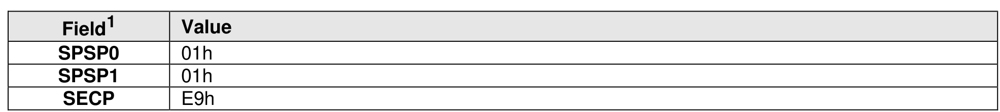
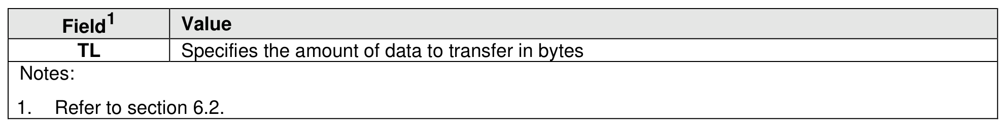
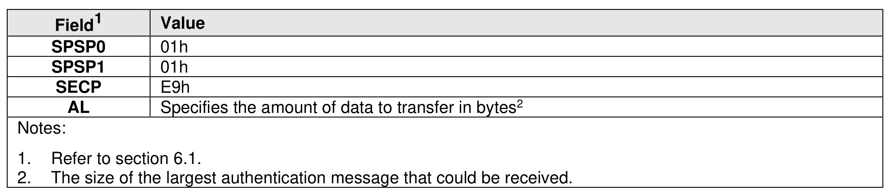

###### 8.3.5.2.2 NVMe In-band Authentication Protocol-Specific Requirements

> **Section ID**: 8.3.5.2.2 | **Page**: 741-742

Authentication requirements for security commands are based on the security protocol indicated by the
SECP field in the command.
The authentication protocols defined by this specification use the security protocol identifier E9h (assigned
to NVMe by SPC-5, a SCSI standard). The messages of the defined authentication protocols are self-
identifying, therefore the SPSP0 field and the SPSP1 field of the Authentication Send and Authentication
Receive commands shall be set to 01h. Authentication messages are mapped to NVMe over Fabrics
command and response pairs. The mapping of authentication messages to the Authentication Send
command is shown in Figure 786.
The mapping of authentication messages to the Authentication Receive command is shown in Figure 787.
Security processing requirements associated with the Authentication Receive command (e.g., delays in
third-party authentication verification) may result in delays in controller completion of an Authentication
Receive command. The host should consider these possible delays associated with the Authentication
Receive command.

---
### 📊 Tables (3)

#### Table 1: Untitled Table

| | Specifies the amount of data to transfer in bytes |
|---|---|
| | Refer to section 6.2. |
| | The dropping of authentication messages to the Authentication Receive command is shown in Figure 787. Processing requirements associated with the Authentication Receive command (e.g., delays in security authentication verification) may result in delays in controller completion of an Authentication |
| | Refer to section 6.1. |
| | The size of the largest authentication message that could be received. |
| **Secure Channel Concatenation** | |
| | It is possible to leverage an authentication transaction to generate shared key material to use as pre-shared key (PSK) to establish a secure channel (e.g., with IPsec or TLS). This PSK is generated by an authentication transaction on an Admin Queue over an insecure channel. Once the authentication transaction is completed, that Admin Queue transport connection shall be disconnected by the host. The generated PSK may then be used to set up secure channels for subsequent Admin Queue(s) and I/O |

#### Table 2: Untitled Table

(Continuation of Untitled Table - see first part)

#### Table 3: Untitled Table

(Continuation of Untitled Table - see first part)

