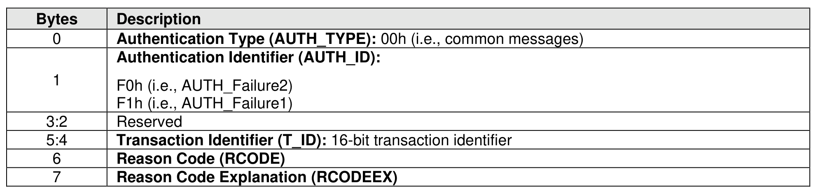
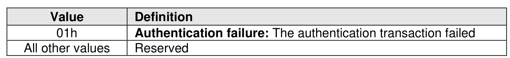
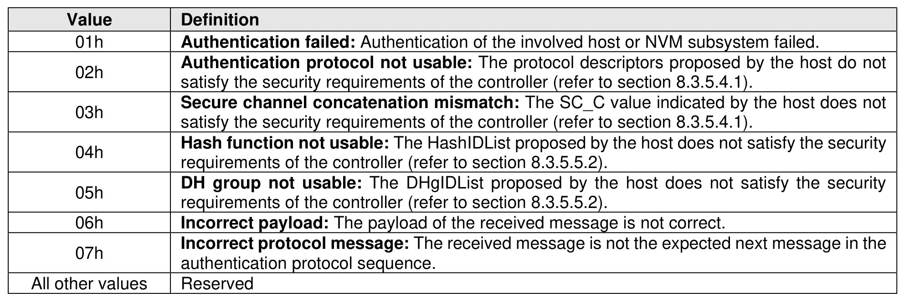

###### 8.3.5.4.2 AUTH_Failure Messages

> **Section ID**: 8.3.5.4.2 | **Page**: 745-746

The AUTH_Failure1 message is sent from the controller to the host, the AUTH_Failure2 message is sent
from the host to the controller. The format of the AUTH_Failure1 message and of the AUTH_Failure2
message is shown in Figure 792.
The AUTH Failure reason codes are listed in Figure 793.
The AUTH_Failure reason code explanations are listed in Figure 794.

---
### 📊 Tables (3)

#### Table 1: Untitled Table

| Value | Definition |
|---|---|
| 01h | **Authentication failure**: The authentication transaction failed |
| All other values | Reserved |
| 02h | **Authentication protocol not usable**: The protocol descriptors proposed by the host do not satisfy the security requirements of the controller (refer to section 8.3.5.4.1). |
| 03h | **Secure channel concatenation mismatch**: The SC_C value indicated by the host does not satisfy the security requirements of the controller (refer to section 8.3.5.4.1). |
| 04h | **Hash function not usable**: The HashIDList proposed by the host does not satisfy the security requirements of the controller (refer to section 8.3.5.5.2). |
| 05h | **DH group not usable**: The DHgIDList proposed by the host does not satisfy the security requirements of the controller (refer to section 8.3.5.5.2). |
| 06h | **Incorrect payload**: The payload of the received message is not correct. |
| 07h | **Incorrect protocol message**: The received message is not the expected next message in the authentication protocol sequence. |
| er values | Reserved |

#### Table 2: Untitled Table

(Continuation of Untitled Table - see first part)

#### Table 3: Untitled Table

(Continuation of Untitled Table - see first part)

