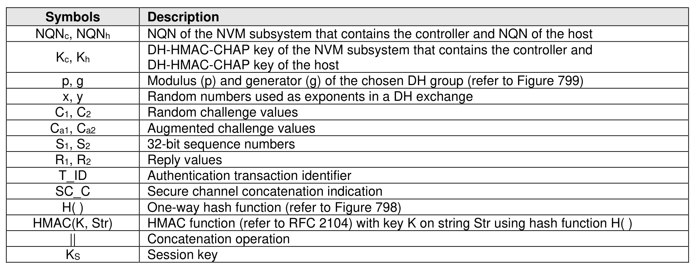

###### 8.3.5.5.1 Protocol Operations

> **Section ID**: 8.3.5.5.1 | **Page**: 746-748

DH-HMAC-CHAP is a key based Authentication and key management protocol that uses the Challenge
Handshake Authentication Protocol (CHAP, refer to RFC 1994) enhanced to use the Hashed Message
Authentication Code (HMAC) mechanism (refer to RFC 2104) with stronger hash functions and augmented
with an optional Diffie-Hellman (DH) exchange (refer to RFC 2631, clause 2.2.1). DH-HMAC-CHAP
provides bidirectional or unidirectional Authentication between a host and a controller.
The Diffie-Hellman part of the protocol is optional. When the Diffie-Hellman part of the protocol is not used,
DH-HMAC-CHAP is referred to as HMAC-CHAP. If insufficiently random keys are used (refer to section
8.3.5.5.7), HMAC-CHAP potentially allows a passive eavesdropper to discover the key through an off-line
dictionary attack, so its usage should be minimized. DH-HMAC-CHAP provides strong protection from
passive eavesdroppers. However, an active attacker could reduce the operation of this protocol so that only
HMAC-CHAP is used, and as a result gain sufficient information to mount an off-line dictionary attack on
the HMAC-CHAP key.
An implementation that supports DH-HMAC-CHAP authentication shall support DH-HMAC-CHAP with a
NULL DH exchange. All implementations of DH-HMAC-CHAP shall be configurable to require a DH
exchange (i.e., to not use HMAC-CHAP).
In order to authenticate with the DH-HMAC-CHAP protocol, each host and NVM subsystem shall be
provided with a DH-HMAC-CHAP key that is associated with the entity’s NQN. Two entities may
impersonate one another if they have the same key, therefore when the assigned keys are not different for
each entity there is a security vulnerability (refer to section 8.3.5.5.7).
To authenticate another entity, an entity is required to either:
a) know the key associated with the entity to be authenticated; or
b) rely on a third party that knows the key to verify the authentication (refer to section 8.3.5.5.11).
An example of a DH-HMAC-CHAP authentication transaction is shown in Figure 795, with the notation
shown in Figure 796. The DH-HMAC-CHAP_Success2 message that is shown as a dashed line is used
only for bidirectional authentication.
When used with a non-NULL DH exchange, the DH-HMAC-CHAP protocol is able to generate a session
key KS to be used to establish a TLS session between host and controller (refer to section 8.3.5.5.9).
For an NVM subsystem, the controller is the entity running the protocol, using the identity and credentials
of the NVM subsystem. The DH-HMAC-CHAP protocol proceeds in the following order:
1) The authentication transaction shall begin with the host sending the common AUTH_Negotiate
message to negotiate the authentication protocol to use and its associated parameters (refer to
section 8.3.5.4.1). The AUTH_Negotiate message carries the transaction identifier (T_ID) for the
entire authentication transaction and the list of authentication protocol descriptors for the
authentication protocols that may be used in this authentication transaction. For DH-HMAC-CHAP,
the authentication protocol descriptor includes the list of hash functions (HashIDList) and Diffie-
Hellman group identifiers (DHgIDList) that may be used in this authentication protocol transaction.
2) If the parameters of the received DH-HMAC-CHAP protocol descriptor are compatible with the
controller’s policies, then the controller shall reply with a DH-HMAC-CHAP_Challenge message
(refer to section 8.3.5.5.3) carrying the same transaction identifier value (T_ID) received in the
AUTH_Negotiate message, the identifiers of the hash function (HashID) and the DH group (DHgID)
selected for use among the ones proposed by the host in the AUTH_Negotiate message, a
sequence number (S1), a random challenge value (C1), and the DH exponential (gx mod p). If the
controller selects a NULL DH group identifier, then the DH portion of the DH-HMAC-CHAP protocol
shall not be used, and the protocol reduces to a HMAC-CHAP transaction.
3) If the received DH-HMAC-CHAP_Challenge message is valid, then the host shall send a DH-
HMAC-CHAP_Reply message (refer to section 8.3.5.5.11) carrying the same transaction identifier
value (T_ID), the response R1 to the challenge value C1, and its own DH exponential (gy mod p).
The DH Value Length shall be cleared to 0h if the controller has sent a NULL DH group identifier
in the DH-HMAC-CHAP_Challenge message. If bidirectional authentication is requested, then the
DH-HMAC-CHAP_Reply message shall carry also a sequence number S2 and a random challenge
value C2 that differs from the challenge value C1 received in the DH-HMAC-CHAP_Challenge
message.
4) If the authentication verification by the controller succeeds, then the controller shall reply with a
DH-HMAC-CHAP_Success1 message (refer to section 8.3.5.5.5) carrying the same transaction
identifier value (T_ID). If bidirectional authentication was requested, then the DH-HMAC-
CHAP_Success1 message shall also carry the response R2 to the challenge value C2. If the
authentication verification fails, then the controller shall send an AUTH_Failure1 message and
disconnect the NVMe over Fabrics connection upon transmitting it.
5) The authentication transaction ends here, unless bidirectional authentication has been requested.
In this case, as shown by the dashed arrow in Figure 795, if the authentication verification by the
host succeeds, then the host shall send a DH-HMAC-CHAP_Success2 message (refer to section
8.3.5.5.6) carrying the same transaction identifier value (T_ID). If the authentication verification
fails, then the host shall send an AUTH_Failure2 message and disconnect the NVMe over Fabrics
connection upon transmitting it.
If the controller receives a message that is not the expected next message in the DH-HMAC-CHAP protoco
sequence, then the controller shall:
•
reply with an AUTH_Failure1 message having reason code ‘Authentication failure’ and reason code
explanation ‘Incorrect protocol message’; and
•
disconnect the NVMe over Fabrics connection upon transmitting the AUTH_Failure1 message.
If the host receives a message that is not the expected next message in the DH-HMAC-CHAP protoco
sequence, then the host shall:
•
reply with an AUTH_Failure2 message having reason code ‘Authentication failure’ and reason code
explanation ‘Incorrect protocol message’; and
•
disconnect the NVMe over Fabrics connection upon transmitting the AUTH_Failure2 message.
The payload format of a message shall be validated before performing any other security computation.

---
### 📊 Tables (1)

#### Table 1: Untitled Table

| T_ID | Authentication transaction identifier |
|---|---|
| SC_C | Secure channel concatenation indication |
| H() | One-way hash function (refer to Figure 798) |
| HMAC(K, Str) | HMAC function (refer to RFC 2104) with key K on string Str using hash function H() |
| || Concatenation operation |
| Ks | Session key |

