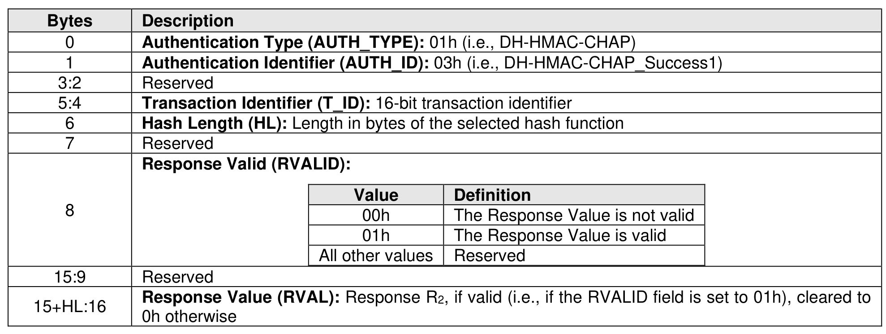

###### 8.3.5.5.5 DH-HMAC-CHAP_Success1 Message

> **Section ID**: 8.3.5.5.5 | **Page**: 753-754

The DH-HMAC-CHAP_Success1 message is sent from the controller to the host and indicates that the
controller has successfully authenticated the host. The format of the DH-HMAC-CHAP_Success1 message
is shown in Figure 802.
Hash Length (HL): Shall be set to the length in bytes of the selected hash function, as specified in Figure
798.
Response Valid: If the host did not request authentication of the controller (i.e., bidirectional authentication)
this field shall be cleared to 0h to indicate that no response is conveyed (i.e., the Response Value field is
not valid). If the host did request authentication of the controller, this field shall be set to 01h.
Response Value (RVAL): DH-HMAC-CHAP response value R2. The value of R2 is computed using the
hash function H( ) selected by the HashID parameter of the DH-HMAC-CHAP_Challenge message, and
the augmented challenge Ca2. If the NULL DH group has been selected, the augmented challenge Ca2 is
equal to the challenge C2 received from the host (i.e., Ca2 = C2). If a non-NULL DH group has been selected,
the augmented challenge is computed applying the HMAC function using the hash function H( ) selected
by the HashID parameter in the DH-HMAC-CHAP_Challenge message with the hash of the ephemeral DH
key resulting from the combination of the random value x selected by the controller with the DH exponential
(i.e., gy mod p) received from the host as HMAC key (refer to RFC 2104) to the challenge C2 (i.e., Ca2 =
HMAC(H((gy mod p)x mod p), C2) = HMAC(H(gxy mod p)), C2). The value of R2 shall be computed applying
the HMAC function using the hash function H( ) selected by the HashID parameter in the DH-HMAC-
CHAP_Challenge message with key Kc as HMAC key to the concatenation of the augmented challenge
Ca2, the sequence number S2, the transaction identifier T_ID, the secure channel concatenation indication
SC_C received in the AUTH_Negotiate message, the ten ASCII characters ”Controller” to indicate the
controller is computing the reply, the NVM Subsystem NQN not including the null terminator, a 00h byte,
and the host NQN not including the null terminator (i.e., R2 = HMAC(Kc, Ca2 || S2 || T_ID || SC_C ||
”Controller” || NQNc || 00h || NQNh)). Using C language notation:
Ca2 = (DHgID == 00h) ? C2 : HMAC(H((gy mod p)x mod p)), C2)
R2 = HMAC(Kc, Ca2 || S2 || T_ID || SC_C || ”Controller” || NQNc || 00h || NQNh)
Upon receiving a DH-HMAC-CHAP Success1 message:
•
if the Hash Length (HL) does not match the value specified in Figure 798 for the selected hash
function, the host shall:
o
reply with an AUTH_Failure2 message having reason code ‘Authentication failure’ and
reason code explanation ‘Incorrect payload’; and
o
disconnect the NVMe over Fabrics connection;
and
•
if the Response Valid field is set to 01h, the host shall verify the response value R2 using the
negotiated hash function and DH group. If verification of the response value R2 does not succeed,
the host shall:
o
reply with an AUTH_Failure2 message having reason code ‘Authentication failure’ and
reason code explanation ‘Authentication failed’; and
o
disconnect the NVMe over Fabrics connection.
If verification of the response value R2 succeeds, the controller has been authenticated and the host shall
continue with a DH-HMAC-CHAP_Success2 message.

---
### 📊 Tables (1)

#### Table 1: Untitled Table

| 9 | Reserved |
|---|---|
| :16 | **Response Value (RVAL):** Response R2, if valid (i.e., if the RVALID field is set to 01h), cleared to 0h otherwise |

