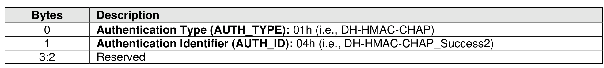
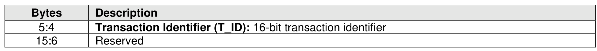

###### 8.3.5.5.6 DH-HMAC-CHAP_Success2 Message

> **Section ID**: 8.3.5.5.6 | **Page**: 754-755

The DH-HMAC-CHAP_Success2 message is sent from the host to the controller and indicates that the host
has successfully authenticated the controller. The format of the DH-HMAC-CHAP_Success2 message is
shown in Figure 803.

---
### 📊 Tables (2)

#### Table 1: Untitled Table

| Bytes | Description |
|:---|:---|
| 0 | Authentication Type (AUTH_TYPE): 01h (i.e., DH-HMAC-CHAP) |
| 1 | Authentication Identifier (AUTH_ID): 04h (i.e., DH-HMAC-CHAP_Success2) |
| 3:2 | Reserved |
| 6 | Reserved |

#### Table 2: Untitled Table

(Continuation of Untitled Table - see first part)

