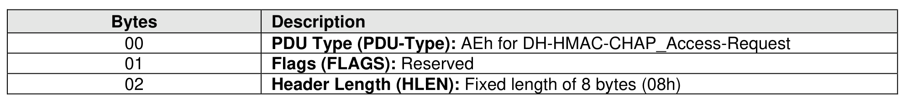
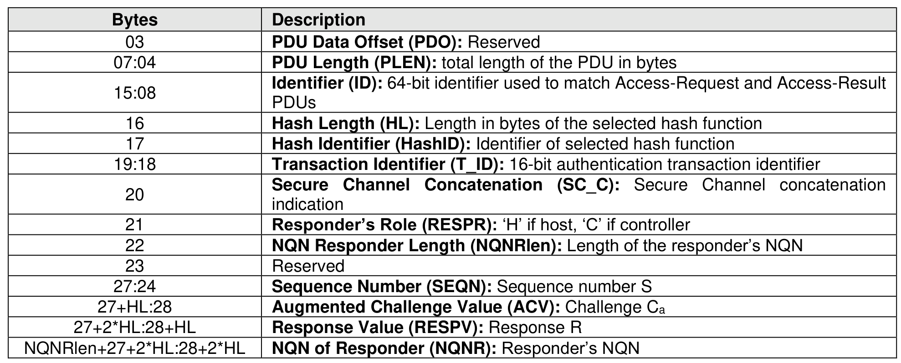
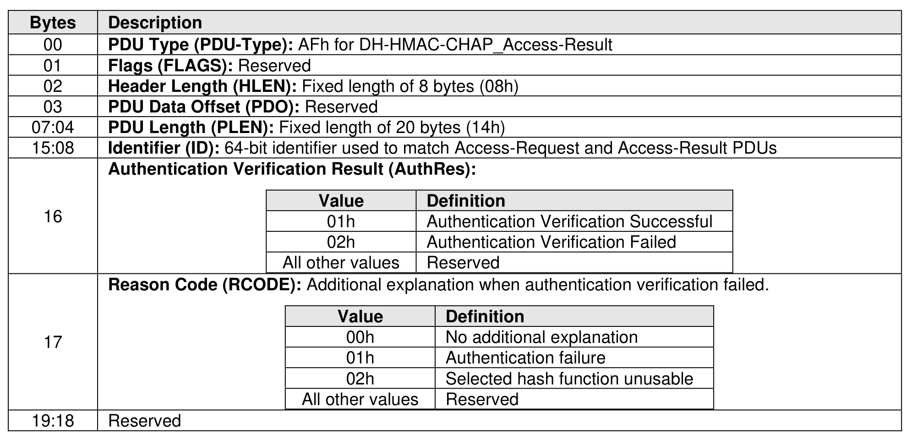

###### 8.3.5.6.3 AVE Access Protocol

> **Section ID**: 8.3.5.6.3 | **Page**: 763-765

Communication with a DH-HMAC-CHAP AVE uses two PDUs, DH-HMAC-CHAP_Access-Request and
DH-HMAC-CHAP_Access-Result, that are sent directly over the TLS connection with the AVE (refer to
section 8.3.5.6.2). The format of the DH-HMAC-CHAP Access-Request PDU is shown in Figure 813.
The DH-HMAC-CHAP_Access-Request PDU contains the parameters exchanged by the host and the
controller during a DH-HMAC-CHAP authentication transaction. The responder is the entity that replied to
a DH-HMAC-CHAP challenge sent by an authenticator.
Referring to Figure 812, when the controller transmits the DH-HMAC-CHAP_Access-Request PDU, the
parameters are instantiated as follows:
•
Responder’s Role: ‘H’
•
Sequence Number: S1
•
Augmented Challenge Value: Ca1
•
Response Value: R1
•
NQNR: NQNh
•
HashID, T_ID, SC_C: the correspondent DH-HMAC-CHAP parameters
When the host transmits the DH-HMAC-CHAP_Access-Request PDU, the parameters are instantiated as
follows:
•
Responder’s Role: ‘C’
•
Sequence Number: S2
•
Augmented Challenge Value: Ca2
•
Response Value: R2
•
NQNR: NQNc
•
HashID, T_ID, SC_C: the correspondent DH-HMAC-CHAP parameters
Upon receiving a DH-HMAC-CHAP_Access-Request PDU, the AVE shall perform the following steps in
order:
1.
Lookup the DH-HMAC-CHAP key of the responder (i.e., Kr) from NQNR;
2.
If the Responder’s Role is ‘H’, compute the expected response R’ as:
R’ = HMAC(Kr, Ca || S || T_ID || SC_C || ”HostHost” || NQNr || 00h || NQNa)
where NQNa is the NQN of the authenticator;
3.
If the Responder’s Role is ‘C’, compute the expected response R’ as:
R’ = HMAC(Kr, Ca || S || T_ID || SC_C || ”Controller” || NQNr || 00h || NQNa)
where NQNa is the NQN of the authenticator; and
4.
Compare the expected response R’ with the response value R received in the DH-HMAC-
CHAP_Access-Request PDU. If R’ = R then the authentication is successful; if R’ ≠ R then the
authentication has failed.
The NQN of the authenticator (i.e., NQNa) is retrieved from the TLS identity associated to the TLS
connection with the AVE (refer to section 8.3.5.6.2).
The result of an authentication verification is returned to the NVMe entity in a DH-HMAC-CHAP_Access-
Result PDU. The format of the DH-HMAC-CHAP_Access-Result PDU is shown in Figure 814.

---
### 📊 Tables (3)

#### Table 1: Untitled Table

| Bytes | Description |
|:---|:---|
| 00 | PDU Type (PDU-Type): AEh for DH-HMAC-CHAP_Access-Request |
| 01 | Flags (FLAGS): Reserved |
| 02 | Header Length (HLEN): Fixed length of 8 bytes (08h) |
| 03 | PDU Data Offset (PDO): Reserved |
| 07:04 | PDU Length (PLEN): total length of the PDU in bytes |
| 15:08 | Identifier (ID): 64-bit identifier used to match Access-Request and Access-Result PDUs |
| 16 | Hash Length (HL): Length in bytes of the selected hash function |
| 17 | Hash Identifier (HashID): Identifier of selected hash function |
| 19:18 | Transaction Identifier (T_ID): 16-bit authentication transaction identifier |
| 20 | Secure Channel Concatenation (SC_C): Secure Channel concatenation indication |
| 21 | Responder's Role (RESPR): 'H' if host, 'C' if controller |
| 22 | NQN Responder Length (NQNRlen): Length of the responder's NQN |
| 23 | Reserved |
| 27:24 | Sequence Number (SEQN): Sequence number S |
| 27+HL:28 | Augmented Challenge Value (ACV): Challenge Ca |
| 27+2*HL:28+HL | Response Value (RESPV): Response R |
| en+27+2*HL:28+2*HL | NQN of Responder (NQNR): Responder's NQN |

DH-HMAC-CHAP_Access-Request PDU contains the parameters exchanged by the host and the responder during a DH-HMAC-CHAP authentication transaction. The responder is the entity that replied to the HMAC-CHAP challenge sent by an authenticator.

According to Figure 812, when the controller transmits the DH-HMAC-CHAP_Access-Request PDU, the parameters are instantiated as follows:

| | |
|:---|:---|
| | Header Length (HLEN): Fixed length of 8 bytes (08h) |
| | PDU Data Offset (PDO): Reserved |
| | PDU Length (PLEN): Fixed length of 20 bytes (14h) |
| | Identifier (ID): 64-bit identifier used to match Access-Request and Access-Result PDUs |
| | Authentication Verification Result (AuthRes): |
| | <table><tr><th>Value</th><th>Definition</th></tr><tr><td>01h</td><td>Authentication Verification Successful</td></tr><tr><td>02h</td><td>Authentication Verification Failed</td></tr><tr><td>All other values</td><td>Reserved</td></tr></table> |
| | Reason Code (RCODE): Additional explanation when authentication verification failed. |
| | <table><tr><th>Value</th><th>Definition</th></tr><tr><td>00h</td><td>No additional explanation</td></tr><tr><td>01h</td><td>Authentication failure</td></tr><tr><td>02h</td><td>Selected hash function unusable</td></tr><tr><td>All other values</td><td>Reserved</td></tr></table> |
| | Reserved |

#### Table 2: Untitled Table

(Continuation of Untitled Table - see first part)

#### Table 3: Untitled Table

(Continuation of Untitled Table - see first part)

